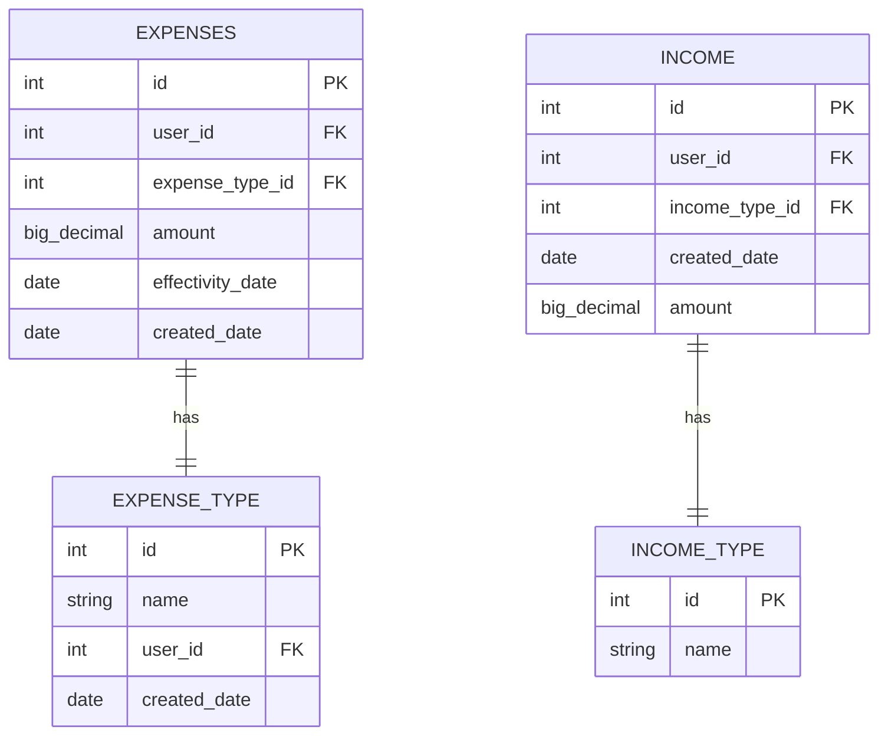

# Expense Tracking System:

---

@Authors:

- Agasen, Ian Neil
- Agulto, Ajay

### Usage:

UI:

1. Per Day
   1. CRUD expenses at any day
   2. CRUD allocated budget(income) per day
2. Input (CRUD) expense category

Savings(Goal) = Income - Expenses

### Limitations

1.  Can only add expense for current day

### Entities

1. Expenses
2. Expense Type
3. Income - Income per month
4. Income Type:
   1. Values:
      1. Q - quarterly
      2. A - annual
      3. M - monthly
      4. S - semi-annual

### Tables:

### PACKAGE STRUCTURE

1. Resource
   - Controller
2. Domain
   - Model
   - Service
   - Repository

### Accessing H2 Embeded:

URL: http://localhost:8080/h2-console/login.jsp?jsessionid=e1e30c3eea07f8f8aca15f9a7938e3cf

### Accessing Swagger-ui

URL: http://localhost:8080/swagger-ui/index.html#

### Endpoints:

- /expenses:
  - GET/expense - get all expenses
  - GET/expense/types - get all expense types
  - GET/expense/date - get all expenses filtered by date
  
- /income:
  - GET/income - get all income
  - GET/income/types - get all income types

### TODO

- [ ] Add Exception Handling
- [ ] Create Audit Trail / Historical Table
- [ ] CRUD Function for Expense Type
- [ ] CRUD Function for Expenses
- [ ] CRUD Function for Income
- [ ] /savings/{day} - tbd
- CLARIFY IF INCOME 
